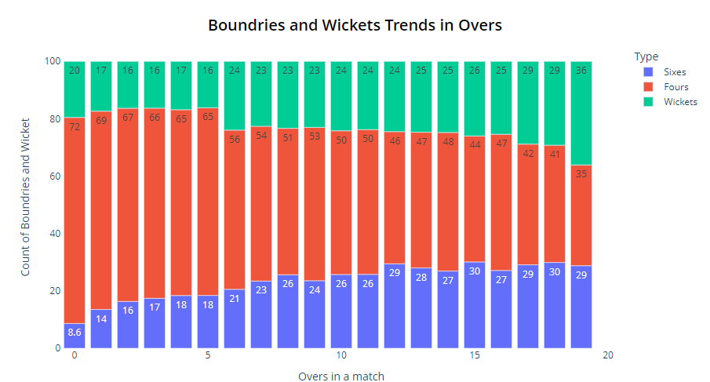

# IPL Data Analysis Project

## Website : `https://ipldashboard-445103.ue.r.appspot.com/`

## Overview
This project involves the analysis of IPL (Indian Premier League) cricket data to derive insights and visualize trends. The analysis uses Python and Plotly Dash to create an interactive dashboard for exploring various aspects of IPL matches and player performances.

---

## Features

1. **Interactive Dashboard:**
   - Visualizations for team performances across seasons.
   - Analysis of player performances with key metrics.
   - Dynamic dropdowns to filter data and customize views.

    Access the app at `https://ipldashboard-445103.ue.r.appspot.com/`

2. **Custom Visualizations:**
   - Line charts, bar graphs, and pivot tables to illustrate trends.
   - Separate legends for clearer data interpretation.

3. **Responsive Design:**
   - The dashboard is designed to be user-friendly and works well on different devices.

4. **Cloud Deployment:**
   - Hosted on Google Cloud Platform using App Engine.

---

## Data Sources
The project uses IPL match data, including:
- Match details (e.g., teams, scores, winners).
- Player statistics (e.g., runs, wickets, strike rates).

The data is pre-processed and stored in a pickle file (`Df_matches.pkl`) for faster loading and analysis.

---

## Technical Stack

### Languages and Libraries
- **Python:**
  - `dash` for creating the interactive web app.
  - `plotly` for advanced data visualization.
  - `pandas` for data manipulation and analysis.
  - `Anaconda` for managing the Python environment, including Jupyter notebooks, libraries, and packages for data analysis, scientific computing, and machine learning.
- **Gunicorn:** For serving the Dash app in production.

### Deployment
- **Google App Engine:**
  - Scalable hosting with configuration defined in `app.yaml`.
  - Automatic scaling to handle traffic load.

---

## Project Structure

```
├── src/
│   ├── dash1.py             # Module for specific visualizations
│
├── assets/
│   ├── logo.webp            # Logo for the dashboard
│
├── Df_matches.pkl           # Preprocessed IPL data
├──EDA_deleiveries.ipynb     # Exploratory data analysis for deliveries
├──EDA_matches.ipynb         # Exploratory data analysis for matches
├── app.yaml                 # Google App Engine configuration
├── IPl_Dash.py              # Main application entry point
├── requirements.txt         # Dependencies
└── README.md                # Project documentation
```

---

## Quick Exploring of EDA Files

The project includes two Jupyter notebooks for exploratory data analysis (EDA): `EDA_deleiveries.ipynb` and `EDA_matches.ipynb`. These notebooks Which have more Deep analysis of data and visualizations. You can run them to see the insights and visualizations.

### I am giving a brief overview of the EDA files:

### *Trends Across Overs*

1. **Trends Across Overs**:  
   - The chart visualizes **Sixes (in blue), Fours (in red), and wickets (in green)** over the course of **20 overs** in a cricket match.  
   - Each stacked bar represents the breakdown of counts (boundaries, wickets) for a specific over.

2. **Boundaries Increase in Death Overs**:  
   - In the early overs (0–5), Sixes (blue section) are relatively low but **increase significantly** towards the end of the match (overs 15–20).  
   - For example, Sixes reach a peak value of around **30** in overs 15–20.

3. **Wickets Rise in Final Overs**:  
   - Wickets (green section) remain steady for most of the innings but **increase sharply in the 20th over**, indicating that bowlers take more wickets in the final phase of the match.  
   - Wickets jump to **36** in the 20th over, which shows a critical point of the game.

### *Cities Hosting the Most Matches*


1. **Mumbai Leads**:  
   - Mumbai stands out significantly, hosting **170 matches**, which is far higher than any other city.  

2. **Top Contenders**:  
   - Kolkata (93 matches) and Delhi (90 matches) follow Mumbai, showing consistent hosting capability.  

3. **Low-End Cities**:  
   - Cities like **International venues and Pune** have hosted only **51 matches**, highlighting fewer opportunities for hosting IPL games.

---

### *Top 10 Players of the Match*

1. **AB de Villiers Dominates**:  
   - AB de Villiers leads the chart with **25 Man of the Match awards**, showcasing his consistent match-winning performances.  

2. **Close Competition**:  
   - CH Gayle (22 awards) and RG Sharma (19 awards) are among the other top-performing players.  

3. **Tight Margins for Others**:  
   - Players like SR Watson, YK Pathan, and RA Jadeja share **16 awards**, indicating competitive performance among these players.

---

### *Matches Played by Each IPL Team*

1. **Mumbai Indians Lead**:  
   - Mumbai Indians played the most matches (**261 matches**) with a notable split between **144 wins (blue)** and **117 losses (red)**.  

2. **Performance of Teams**:  
   - Teams like Chennai Super Kings and Kolkata Knight Riders are close competitors, playing around **200 matches** with varying win/loss records.  

3. **Lower-Participation Teams**:  
   - Teams like **Kochi Tuskers Kerala** (8 matches) and **Rising Pune Supergiant** played very few matches, likely due to shorter team lifespans in IPL history.

## Usage Instructions

1. **Setup Environment:**
   Install the necessary libraries using:
   ```bash
   pip install -r requirements.txt
   ```

2. **Run Locally:**
   Start the Dash app locally:
   ```bash
   python IPl_Dash.py
   ```
   Access the app at `http://127.0.0.1:8050`.

3. **Deploy to Google Cloud:**
   - Configure `gcloud` with your project.
   - Deploy the app:
     ```bash
     gcloud app deploy
     ```

---

## Key Insights
- **Team Performance Trends:** Compare the winning percentages of teams across seasons.
- **Player Contributions:** Analyze top players' contributions in terms of runs, wickets,economy and strike rates.

---

## Future Enhancements
- Add more granular insights such as:
  - Venue-based team/player performance.
  - Player performance in specific match conditions.
- Introduce predictive analytics using machine learning.

---

## Credits
- **Developers:** Saran Pandiyan B
- **Data Source:** `https://www.kaggle.com/datasets/patrickb1912/ipl-complete-dataset-20082020`- Prateek Bhardwaj

---

## Contact
- **LinkedIn:** `https://www.linkedin.com/in/saran-pandiyan-b-6b033521b/`
- **Email:** `pandiyansaran7@gmail.com`

Thank you for exploring the IPL Data Analysis project!

